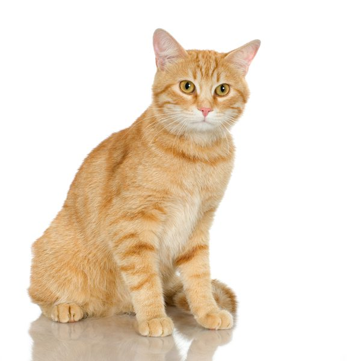

# CatDogClassifier
## Command
`python predict.py <ImgFileName>`

## Real life example
| |
|:-:|
|Cat: 0.80318516 Dog: 0.01585233|

## Example
| ||
|:-:|:-:|
|Dog: 0.91169673 Cat: 0.21185245|Cat: 0.911785395 Dog: 0.38928902|
